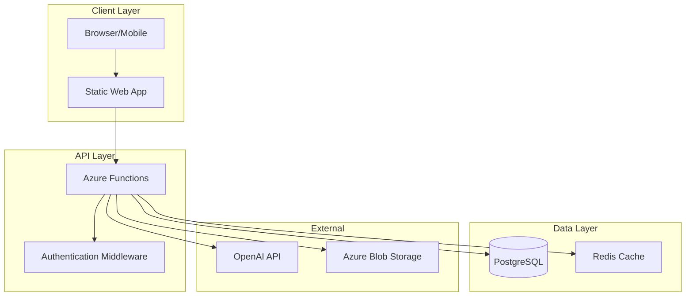

# Architecture Documentation Generator

**Purpose**: Generate comprehensive, PDF-ready architecture documentation for any project.

---

## When to Use

- New project kickoff (before implementation)
- Major architectural changes
- Onboarding documentation
- Project handover
- Audit/compliance requirements

---

## Workflow

### Step 1: Gather Project Information

Collect via exploration or ask user:

```markdown
## Project Information Needed

1. **Project Name**: [name]
2. **Description**: [1-2 sentence summary]
3. **Type**: [web app, API, CLI, library, etc.]
4. **Tech Stack**: [languages, frameworks, databases]
5. **Key Features**: [main capabilities]
6. **Deployment Target**: [Azure, AWS, on-prem, etc.]
```

### Step 2: Analyze Existing Code (if exists)

#### 2a. Manual Analysis

```bash
# Get structure
find . -type f -name "*.ts" -o -name "*.py" -o -name "*.js" | head -50

# Find API routes
grep -r "router\.\|@app\.\|@Get\|@Post" --include="*.ts" --include="*.py" | head -20

# Find DB models
grep -r "class.*Model\|@Entity\|Table\(" --include="*.ts" --include="*.py" | head -20

# Find config files
ls -la *.json *.yaml *.yml 2>/dev/null
```

#### 2b. AI-Assisted Analysis (Gemini)

For complex codebases, use Gemini to infer architecture:

```
Tool: mcp__gemini__gemini-analyze-code
Inputs:
- code: [Read entry point + key modules]
- focus: "general"

Prompt: "Analyze this codebase and identify:
1. Architectural layers (API, service, data, utils)
2. Key patterns used (repository, factory, singleton, etc.)
3. External dependencies and their roles
4. Data flow from entry to persistence
Return as structured markdown with Mermaid diagram."
```

#### 2c. Dependency Graph Generation

Trace import chains to build dependency map:

```python
# Pseudo-algorithm for Python projects
1. Start from entry point (function_app.py, main.py)
2. Parse imports recursively (max depth: 15)
3. Build adjacency list: { module: [dependencies] }
4. Convert to Mermaid:
   graph TD
     main --> services
     services --> models
     services --> utils
```

### Step 3: Generate Documentation

Use template from `~/.claude/templates/architecture-pdf.md`:

```markdown
# [Project Name] - Architecture Document

**Version**: 1.0
**Date**: [YYYY-MM-DD]
**Author**: [name]
**Status**: [Draft/Review/Approved]

---

## 1. Executive Summary

[2-3 paragraphs describing what the system does, why it exists, and key value proposition]

---

## 2. System Overview

### 2.1 Purpose
[What problem does this solve?]

### 2.2 Scope
[What's included and explicitly excluded]

### 2.3 Key Stakeholders
| Role | Responsibility |
|------|----------------|
| [Role] | [What they care about] |

---

## 3. Architecture Overview

### 3.1 High-Level Diagram (Mermaid)

Use Mermaid for GitHub/Azure DevOps compatible diagrams:



### 3.1.1 Alternative: ASCII Diagram (for terminals)

```
┌─────────────┐     ┌─────────────┐     ┌─────────────┐
│   Client    │────▶│   API       │────▶│  Database   │
│  (Browser)  │     │  (Node.js)  │     │ (PostgreSQL)│
└─────────────┘     └─────────────┘     └─────────────┘
```

### 3.2 Component Description

| Component | Technology | Purpose |
|-----------|------------|---------|
| [Name] | [Tech] | [What it does] |

### 3.3 Data Flow
[Describe how data moves through the system]

---

## 4. Technical Details

### 4.1 Technology Stack

| Layer | Technology | Version | Justification |
|-------|------------|---------|---------------|
| Frontend | [tech] | [ver] | [why chosen] |
| Backend | [tech] | [ver] | [why chosen] |
| Database | [tech] | [ver] | [why chosen] |
| Infrastructure | [tech] | [ver] | [why chosen] |

### 4.2 API Design

#### Endpoints
| Method | Path | Description |
|--------|------|-------------|
| GET | /api/v1/[resource] | [desc] |

#### Authentication
[How auth works]

### 4.3 Database Schema

#### Tables
| Table | Purpose | Key Fields |
|-------|---------|------------|
| [name] | [purpose] | [fields] |

#### Relationships
[ERD or description]

---

## 5. Infrastructure

### 5.1 Deployment Architecture

```
┌──────────────────────────────────────────┐
│              Azure Cloud                  │
│  ┌────────────┐    ┌────────────────┐    │
│  │  Static    │    │   Functions    │    │
│  │  Web App   │    │   (API)        │    │
│  └────────────┘    └────────────────┘    │
│                           │               │
│                    ┌──────▼──────┐        │
│                    │  PostgreSQL │        │
│                    └─────────────┘        │
└──────────────────────────────────────────┘
```

### 5.2 Environment Configuration

| Environment | URL | Purpose |
|-------------|-----|---------|
| Development | localhost:3000 | Local dev |
| Staging | [url] | Testing |
| Production | [url] | Live |

### 5.3 CI/CD Pipeline
[Pipeline description]

---

## 6. Security

### 6.1 Authentication & Authorization
[How users are authenticated]

### 6.2 Data Protection
[Encryption, PII handling]

### 6.3 Security Checklist
- [ ] Input validation
- [ ] SQL injection prevention
- [ ] XSS protection
- [ ] CORS configuration
- [ ] Rate limiting
- [ ] Secrets management

---

## 7. Monitoring & Operations

### 7.1 Logging
[What's logged, where]

### 7.2 Alerting
[What triggers alerts]

### 7.3 Backup & Recovery
[Backup strategy, RTO/RPO]

---

## 8. Decisions Log

| Date | Decision | Rationale | Status |
|------|----------|-----------|--------|
| [date] | [decision] | [why] | [Active/Superseded] |

---

## 9. Appendix

### 9.1 Glossary
| Term | Definition |
|------|------------|
| [term] | [definition] |

### 9.2 References
- [Reference 1]
- [Reference 2]
```

### Step 4: Output Options

**Markdown** (default):
```bash
# Save to project
cat > "$(pwd)/.claude/ARCHITECTURE.md" << 'EOF'
[generated content]
EOF
```

**PDF** (requires pandoc):
```bash
# Check if pandoc available
if command -v pandoc &> /dev/null; then
    pandoc "$(pwd)/.claude/ARCHITECTURE.md" -o "$(pwd)/.claude/ARCHITECTURE.pdf" \
        --pdf-engine=xelatex \
        -V geometry:margin=1in \
        -V fontsize=11pt
else
    echo "Install pandoc for PDF generation: sudo apt install pandoc texlive-xetex"
fi
```

---

## Section Modules

Use `--include` to generate specific sections only:

| Module | Sections |
|--------|----------|
| `all` | Full document (default) |
| `api` | Sections 4.2 (API Design) |
| `db` | Sections 4.3 (Database Schema) |
| `infra` | Section 5 (Infrastructure) |
| `security` | Section 6 (Security) |
| `quick` | Sections 1-3 only (overview) |

---

## Integration with Memory MCP

After generating architecture doc:

```
Entity: [project]-architecture
Type: architecture_document
Observations:
- "Generated: [date]"
- "Version: 1.0"
- "Key decisions: [summary]"
- "Tech stack: [summary]"
```

This enables cross-session retrieval of architectural context.

---

## Example Usage

```
/architecture-doc sentimark --format=md --include=all

Generating architecture documentation for: sentimark
Analyzing codebase...
Found: 45 TypeScript files, 12 API endpoints, 8 DB tables

[Generated ARCHITECTURE.md]

Saved to: ~/projects/sentimark/.claude/ARCHITECTURE.md
Memory MCP entity: sentimark-architecture
```

---

*Part of Silent Kernel Architecture v7.0*
