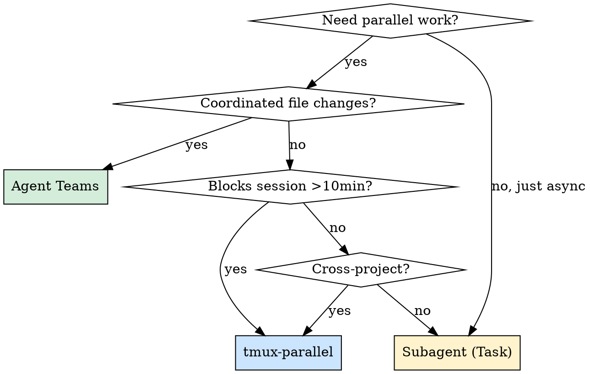

# tmux-parallel

## Overview

Run parallel Claude Code sessions via tmux for workflows where Agent Teams aren't the right tool. Managed by `~/.claude/scripts/tmux-parallel.sh`.

## When to Use



| Scenario | Tool | Why |
|----------|------|-----|
| Multi-file coordinated changes | Agent Teams | Shared context, team-memory |
| Code review sprint | Agent Teams | Structured reviewer-fixer flow |
| Eval round (2+ hours) | **tmux** | Blocks session, needs foreground |
| Multi-model judge panel | **tmux** | Independent, visible output |
| Cross-project hotfix | **tmux** | Different working directories |
| Deploy monitoring | **tmux** | Watch logs while developing |
| Quick research query | Subagent | Cheapest, fire-and-forget |
| Competing hypotheses | Agent Teams | Need to compare in shared context |

## Layouts

| Layout | Panes | Use Case |
|--------|-------|----------|
| `eval` | main + eval-runner + monitor | Long-running eval rounds |
| `multi-judge` | main + 3 judges | Multi-model review scoring |
| `dev-monitor` | main + log tail | Deploy/pipeline monitoring |
| `cross-project` | 2 side-by-side | Simultaneous project work |
| `worker` | main + N workers | Generic parallel claude -p tasks |

## Quick Reference

```bash
# Start a layout
~/.claude/scripts/tmux-parallel.sh start eval ~/projects/hey-seven
~/.claude/scripts/tmux-parallel.sh start multi-judge ~/projects/hey-seven
~/.claude/scripts/tmux-parallel.sh start cross-project ~/projects/hey-seven ~/projects/sentimark

# Send task to worker pane (uses claude -p, writes to shared dir)
~/.claude/scripts/tmux-parallel.sh send judge:1 "Score these 20 scenarios using gemini"

# Manage sessions
~/.claude/scripts/tmux-parallel.sh list          # Show all sessions + panes
~/.claude/scripts/tmux-parallel.sh monitor eval   # Watch shared output files
~/.claude/scripts/tmux-parallel.sh stop eval       # Stop one session
~/.claude/scripts/tmux-parallel.sh stop all        # Stop all cc-* sessions
```

## Coordination

Worker panes write to `~/.claude/tmux-shared/<session>/`. Main session reads results.

```bash
# Worker pane (manual or via 'send' command):
claude -p "analyze these test results" > ~/.claude/tmux-shared/cc-eval/analysis.md

# Main session — read the output file to get results
```

For eval workflows, workers run Python scripts directly (no claude needed):
```bash
# Pane 1: eval runner
python3 tests/evaluation/run_live_eval.py --round r99

# Pane 2: streaming judge
python3 tests/evaluation/streaming_judge.py --watch results/ --category behavioral
```

## tmux Navigation

| Keys | Action |
|------|--------|
| `Ctrl+B` arrow | Move between panes |
| `Ctrl+B z` | Zoom/unzoom pane (fullscreen toggle) |
| `Ctrl+B d` | Detach session (keeps running in background) |
| `Ctrl+B [` | Scroll mode (`q` to exit) |
| `tmux attach -t cc-eval` | Reattach after detach or new terminal |

## Cost and Rate Limits

- Each pane running `claude` = separate Opus context = separate cost
- All panes share your API key = shared rate limits
- Use `claude -p` for workers (single prompt, no interactive overhead)
- Prefer Agent Teams when tasks need shared context (more cost-efficient)
- Max 2-3 concurrent `claude` sessions to avoid rate limit contention

## Common Mistakes

| Mistake | Fix |
|---------|-----|
| Running `claude` (interactive) in worker panes | Use `claude -p "prompt"` instead |
| Closing terminal without detaching | `Ctrl+B d` first — sessions survive detach |
| Starting duplicate sessions | Check `tmux-parallel.sh list` first |
| Sending tasks to pane 0 | Pane 0 is your main interactive session |
| Running 4+ claude sessions at once | Rate limits — keep to 2-3 max |
| Expecting shared context between panes | Panes are isolated — use shared files for coordination |
